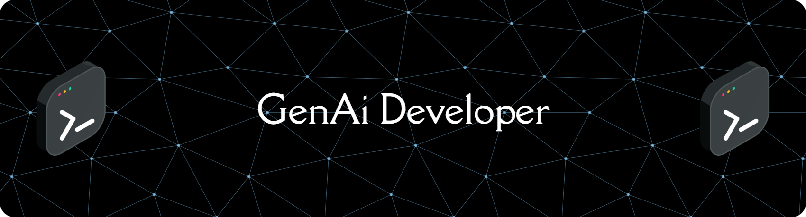

<h1 align="center">Hi 👋, I'm Aditya Walture</h1>

  

  

- 🔭 I’m currently working in **Philips as ML intern**
- 👯 I’m looking to collaborate on **Flutter & ML projects**
- 🌱 I’m currently learning **Flutter, NLP, automation**

- 📫 How to reach me **adityawalture9298@gmail.com**
- 📄 Know about my experiences **[https://drive.google.com/file/d/1cRh2t-B9Os7fF1pxWW5XI8XdKBbuCyeJ/view?usp=sharing](https://drive.google.com/file/d/1TnFPvez5XZVQh6bxQK3txP8H2MHPRZeH/view?usp=sharing)**
<h3 align="left">Connect with me:</h3>

<h3 align="left">Languages and Tools:</h3>

<h3 align="left">Stars</h3>

&nbsp;

<h3 align="center">Statistics</h3>

<a href="https://github.com/adityawalture">

<h2 align="left">⚡Activity Graph:</h2>

